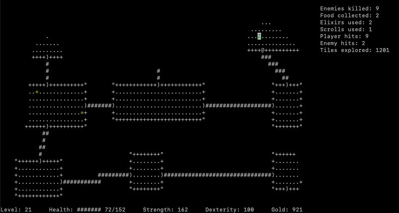

# [GoRogue]



**GoRogue** — это консольная игра в жанре roguelike, написанная на языке Go с использованием библиотеки `goncurses`. Проект вдохновлён классической игрой Rogue (1980) и создан с целью погружения в процедурную генерацию и пошаговую механику классических RPG.

## Особенности

*   **Пошаговое исследование:** Классическое перемещение по подземелью, где каждый шаг — это ход.
*   **Процедурная генерация:** Каждый уровень подземелья создается случайным образом, что обеспечивает высокую реиграбельность. Генерация включает в себя 3 на 3 комнаты случайного размера. Комнаты соединены между собой коридорами.
*   **Боевая система:** Схватки с монстрами, чья сила растет с глубиной. Можно экипировать оружие для увеличения базового урона.
*   **Развитие персонажа:** У персонажа есть три основные характеристики:
    *   **Здоровье (HP)** — определяет, сколько урона он может выдержать.
    *   **Сила (Str)** — влияет на наносимый урон.
    *   **Ловкость (Dext)** — позволяет избежать урона.
*   **Инвентарь и предметы:** Находите и используйте магические зелья, свитки, оружие, доспехи и еду. 
*   **Визуализация через ncurses:** Аутентичный консольный интерфейс.

## Управление

*   `w`, `a`, `s`, `d` — перемещение персонажа.
*   `h`, `j`, `k`, `l` — открыть инвентарь(оружие, еда, свитки, зелья).
*   `q` или `ESC` — выход из игры, инвентаря (или подтверждение выхода).


## Установка и запуск

Для запуска игры вам потребуется установленный Go (версия 1.x или новее) и библиотека ncurses.

**1. Установка зависимостей**

*   **Linux (Debian/Ubuntu):**
    ```bash
    sudo apt-get install libncurses-dev
    ```
*   **macOS:**
    ```bash
    brew install ncurses
    ```
*   **Windows:** Рекомендуется использовать [WSL](https://learn.microsoft.com/ru-ru/windows/wsl/) (подсистему Linux для Windows) и следовать инструкциям для вашего дистрибутива Linux.

**2. Клонирование и запуск**

```bash
git clone [https://github.com/ivy-goruden/rogue.git]
cd [папка проекта]
go mod tidy # Убедиться, что все зависимости скачаны
go run ./main.go
